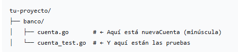
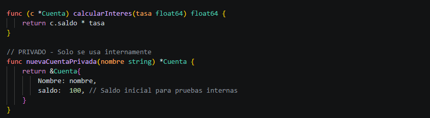

# ENCAPSULACIÓN

Probar el uso de estructuras internas usando encapsulación

De la presentación en clases tenemos

Una vez realizada la prueba interna banco/cuenta_test.go, modificar a banco/cuenta.go agregando los siguientes métodos:

Estos métodos son privados, por lo que también realizaremos las pruebas internar modificando a banco/cuenta_test.go agregando los siguientes métodos de prueba:

1. Ejecuta las pruebas
2. Captura la salida completa de la ejecución (puedes copiar el texto de la terminal o tomar una captura de pantalla).
3. Compara esta nueva ejecución con la ejecución anterior
4. Analiza y responde en tu informe:
- ¿Qué nuevas pruebas aparecen en la ejecución?
- ¿Qué métodos o funcionalidades adicionales se están probando?
- ¿Cómo se refleja en los resultados el hecho de que los nuevos métodos son privados?
- ¿Qué diferencias observas en la cobertura de pruebas entre ambas ejecuciones?
- ¿Qué aprendizaje obtienes sobre la encapsulación en Go a partir de este ejercicio?
5. Entregar el proyecto
