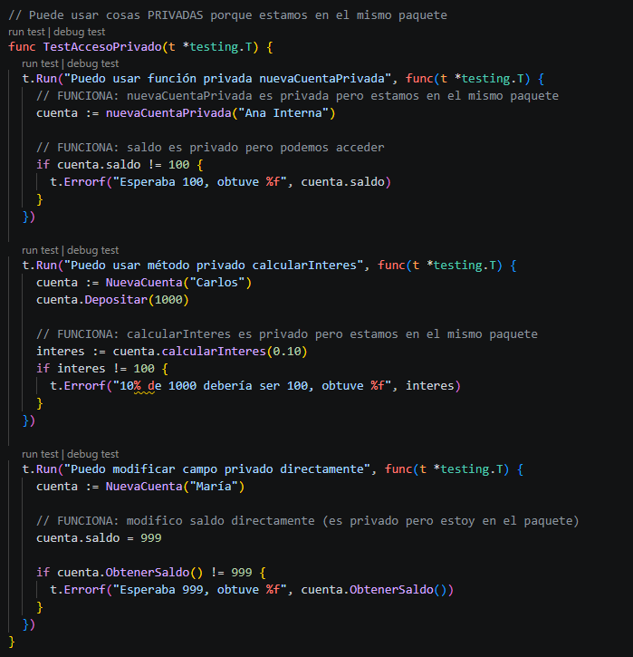
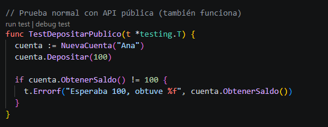

Probar el uso de estructuras internas usando encapsulación

De la presentación en clases tenemos

Una vez realizada la prueba interna banco/cuenta_test.go, modificar a banco/cuenta.go agregando los siguientes métodos:

Estos métodos son privados, por lo que también realizaremos las pruebas internar modificando a banco/cuenta_test.go agregando los siguientes métodos de prueba:

Ejecutar y capturar el resultado de la ejecución, comparar con la ejecución anterior, que ha cambiado?
